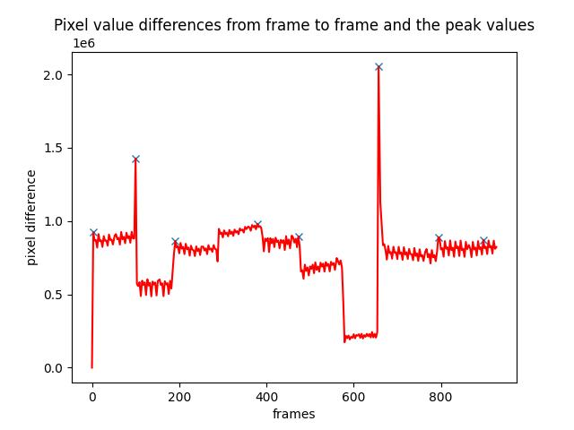

`Forked Key Frame Detector`
- add min/max sample frame num for VLM token limitation
- optimize metrics plot logic
- raise up the value of min_dist when indexing the peak, avoid generating too much similar key frames in the same crest corresponding to the slight change in camera perspective
- add a frame extraction function for extract interval calculation test

 

    

 